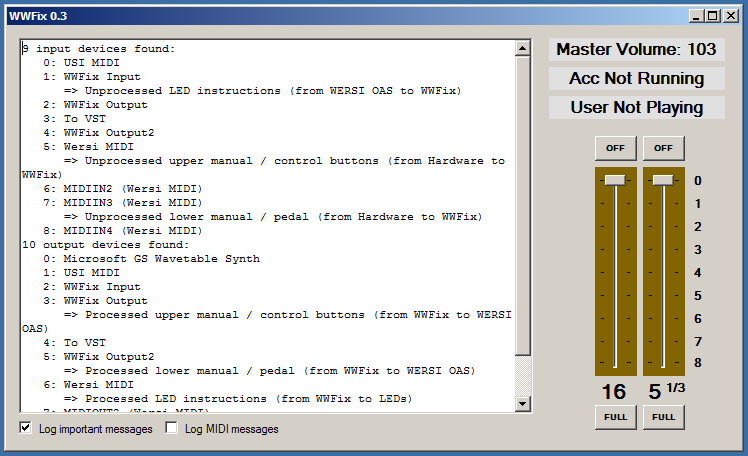

# WingHacks
Small tools for making the great Wersi Pegasus Wing even greater!

The tools are implemented in .NET C#.

# WWFix

This is a small tool to fix various bugs in the OAS software, in particular:

* Audio volume jump after turning on: The Wersi Wing starts with a default volume and ignores to what the volume control potentiomenter is set to. This may cause a volume jump after the device has been turned on. WWFix automatically stores the volume on exit and recalls it upon the next start.
* Styles start with the wrong voices: The OAS application has a bug that causes styles to start playing with the wrong instruments. WWFix circumvents this problem by monintoring the OAS log if a new style has been loaded, and if so, it automatically (and silently!) start and stops it in the background.
* VB3 Vibrato is not activated after loading a preset: WWFix fixes this by "pressing" the vibrato button four times after such a preset is loaded.
* No 16" and 5 1/3" lower drawbars: WWFix provides these in virtual form. :-)

The program works by manipulating the MIDI communication between the physical hardware (i.e., the buttons and on your Wersi Wing) and the WERSI OAS application. This is not a true hack as Wersi actually allows you to set the MIDI input and output devices. Therefore, WWFix only makes use of Wersi's software interfaces.

To install the tool, proceed as follows:

1. Copy the FFix program and associated files (from https://github.com/sebmate/WingHacks/tree/master/WWFix/WWFix/bin/Debug) onto a folder on your harddisk. Create a link to FFix.exe, and put it into the autostart menu of Windows.
2. Install loopMIDI from https://www.tobias-erichsen.de/software/loopmidi.html
3. Create two new virtual MIDI ports, "WWFix Input" and "WWFix Output", as shown in the following image. Note that the "VST" port is optional.

4. Launch WWfix. If everything works fine, WWFix should be able to connect to the virtual ports. If this is the case, the program will display the following after startup:

4. Configure the Wersi OAS application as follows:

5. Start it. It should work!

## WWSwitcher

This is a small task switcher for the Wersi Pegasus Wing keyboard. It allows you to switch between the Wersi OAS application and other Windows programs running in the background. This is very useful when you want to run VSTs and don't want to use a PC keyboard to switch between the Wersi application and the VSTs. How to run VSTs is described here: https://www.oas-forum.de/viewtopic.php?f=26&t=2598 (in German language).

When started, it creates a semi-transparent red button (which is actually a window) in the upper right corner, above the Wersi logo (it's barely visible). When clicking on it, it displays a window with all running tasks:

You can also open the Windows start menu (upper left button), switch to the OAS application (blue button) or exit WWSwitcher (upper right button.

It is recommended to put the EXE file (which can be found here: WWSwitcher/WWSwitcher/bin/Debug/WWSwitcher.exe) into the autostart menu of Windows.

### Limitations:

* It can only deal with six other programs at the moment. But this should be enough.

### Changelog:

* 0.01 to 0.02: The tool now brings itself correctly to the foreground, it now behaves as a user would expect!

