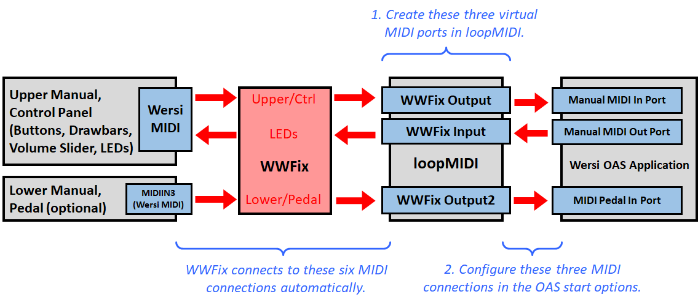
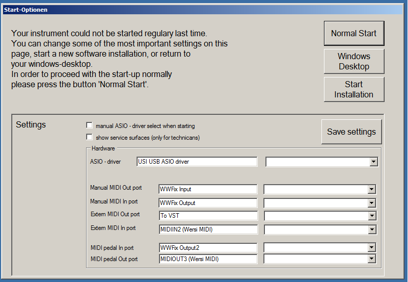

# WingHacks
Small tools for making the great Wersi Pegasus Wing even greater!

The tools are implemented in .NET C#.

# WWFix

WWFix ("Wersi-Wing-Fix") is a small tool to mitigate various bugs in the Wersi Pegasus Wing OAS 8 software. The tool acts as a MIDI proxy, which is placed between the keyboard's physical hardware (i.e. the control panel buttons, drawbars, volume slider, and the manual) and the WERSI OAS application and which manipulates the MIDI communication whenever necessary. This makes it possible to mitigate various bugs and to provide new functionality. WWFix can be kept running in the background; it will do its job silently.

Note that WWFix is not a "hack", as Wersi actually allows you to change the input and output MIDI devices. Therefore, WWFix only makes use of Wersi's official software interfaces. Actually, this is a very clever solution.

Since version 0.3, there is full support for the rare variants with two manuals (Wersi Pegasus Wing Duo).

The program uses the excellent C# MIDI Toolkit by Leslie Sanford (see https://www.codeproject.com/Articles/6228/%2fArticles%2f6228%2fC-MIDI-Toolkit). Thanks for this, Leslie!

The integration is shown in the following chart:

## Fixes provided by WWFix

The tool addresses the following problems:

### Volume jump after switching the Wing on
**Problem:** The Wing always starts with a default volume (50%) and ignores to what the volume slider is actually set. However, if a change is registered at the volume silder (e.g. by random signal noise), this triggers a MIDI event and the volume jumps to the set value. This is very annoying, because forgetting to move the volume control beforehand leads to an unpleasant jump in volume when one is already playing.  
**Implementation in WWFix:** Since WWFix intervenes the MIDI communication, the solution is simple: The tool simply saves the volume on exit/shutdown and restores it at the next system start.  
**Note:** The correct volume is first set when the user presses a key on the keyboard or a control panel button for the first time.  

### Styles start playing with the wrong voices  
**Problem:** The OAS application has a bug that causes styles to start playing with the wrong instruments first (I think only on Acc 3). Probably the software does not completely analyze which instruments are needed by the style.  
**Solution:** A short start of the style initializes all instruments correctly. This needs to be done for Intro 1, 2 and a normal variation.  
**Implementation in WWFix:** The tool monitors the OAS log to see if a new style has been loaded. If so, it automatically starts and stops it silently in the background. This will load the instruments correctly into memory.  
**Limitations/Comment:** Preloading only occurs when WWFix thinks that the auto accompaniment is not running. Therefore you should wait for about 2 seconds between changing the styles. If a style has been pre-loaded, you can tell by the fact that the first indicators of "Number of bars" and "Metronome" on the screen turn red. If these remain blue, the style was not preloaded. The variation LEDs also flicker for a short moment due to the silent start in the background.  

### Bad behaviour of Intro/Ending LEDs   
**Problem:** After editing a style to use any into/ending variations other than 1-2, the LEDs on the control panel are not switched correctly. E.g., when the style is modified to use intros 2-3, and when pressing on the "Intro 2" button, this correctly starts the style's intro 3, but it does not activate the LED of the "Intro 2" button. Instead it seems to activate a "Intro 3" button LED, which of course does not exist.  
**Implementation in WWFix:** The tool simply remembers which button was pressed by the user and then activates this LED.

### The VB3 Vibrato is not activated after loading a preset.  
**Problem:** When loading a preset that uses the VB3, the Vibrato setting is not enabled. The Wersi OAS software correctly passes the vibrato setting (LEDs) to the VB3 VST, but the effect itself is not set to "On" in VB3.  
**Solution:** Manually pressing the Vibrato button on the control panel activates the effect. Pressing the button four times after loading the preset will activate the vibrato effect that is associated with the inital LED indication.  
**Implementation in WWFix:** WWFix simulates pressing the Vibrato button four times after loading such a preset. This "loading" is considered to be detected after the vibrato LEDs are switched by the OAS software.  
**Two-manual version:** This does not yet work on the lower MIDI keyboard on the rare two-manual version, as this manual communicates over another MIDI interface. The vibrato fix is applied after pressing a control panel button or a key on the upper manual.  
**Limitation:** This might not be a proper implementation. Some VB3 voice presets seem to initialize other vibrato effects that are not accessible by the "four-state" hardware button. However, the tool sets the vibrato effect to what the LEDs indicate. I might have to re-think this in a future release.

### No lower 16" and 5 1/3" drawbars  
**Problem:** On many Lower VB3 instruments, the 16" or 5 1/3" drawbars are active and cannot turned down. In general, it is also not possible to manipulate these two missing drawbars.  
**Solution:** WWFix simply provides two virtual drawbars on the program's user interface. In addition, the 16" and 5 1/3" drawbars can be controlled via the 8" and 4" drawbars, as long as the "Lower 2 On" button is held pressed. This allows for manipulating the non-existing drawbars without having to switch to the WWFix window.

## Additional Features

* Press "Ending 1" and "Ending 2" together to trigger a fade-out.
* Press Organ Typ "A B" and "C D" together to open the VB3 VST.
* Single-VB3-VST Mode (see below).
* As stated above, keep "Lower 2 On" pressed and use the Lower 8" and 4" drawbar potis to set the 16" and 5 1/3" drawbars.
* Press "Perc On" and "Perc 2nd/3rd" together to open the task switcher (similar to WWSwitch as shown below)

## Single-VB3-VST Mode (experimental)

In the later versions of the keyboard's software, Wersi is using two VB3 VSTs at the same time, one for the upper and one for the lower manual. This works fine and improves overall usability, but as you can only open the upper VB3 VST, you can not fine-tune the lower one. Also, and this is a bit awkward, this means that there are actually two Hammonds playing through two rotary speakers. 

Here comes the Single-VB3-VST Mode in WWFix. It basically allows you to use only the "upper" VST also for the lower channel. Here's how to use it:

* Turn of the lower VB3 VST if it's running.
* Press Organ Typ "A B" and "C D" together to open the VB3 VST.
* Keep the "Split button" pressed until it blinks. Now press a key on your keyboard to set the split point.

From now on you're in the Single-VB3-VST Mode. WWFix emulates a lower manual and sends all key presses below the split point through this "virtual" lower manual. This allows you to play chords with the auto accompaniment even if the OAS software is not real split mode. And of course, you can use a single VB3 VST to play on the split keyboard.

Experimental: You can use the lower drawbars to controll the VB3 lower ones. This works by emulating mouse drag'n'drop operations and is far from being perfect, so be warned. But you can of course also use the touchscreen. Note that this requires accurate screen coordinates - it will not work if you move the VST window. Also make sure that Windows' appearence setting are set to default.

To leave the Single-VB3-VST Mode, you have to restart the keyboard (or OAS and WWFix). This is because after the OAS software has recieved MIDI events from the lower manual, it thinks it has two and there is no way to stop it from thinking this.

## Installation

To install the tool, proceed as follows:

1. Exit the Wersi OAS application.
2. Copy the FFix program and associated files (from https://github.com/sebmate/WingHacks/tree/master/WWFix/WWFix/bin/Debug) onto a folder on your harddisk. Create a link to WWFix.exe, and put this link into the autostart menu of Windows.
3. Install loopMIDI from https://www.tobias-erichsen.de/software/loopmidi.html
4. Create trhee new virtual MIDI ports, "WWFix Input", "WWFix Output", and "WWFix Output2", as shown in the following image. Note that the "To VST" port is not required.

4. Launch WWfix. If everything works fine, WWFix should be able to connect to the virtual ports. If this is the case, the program will display the following after startup (notice the "=>" messages that indicate that the program has successfully connected to "WWFix Input", "WWFix Output", "WWFix Output2" and "Wersi MIDI"):

4. Configure the Wersi OAS application as follows. Connect "Manual MIDI In" to "WWFix Ouput", "MIDI Pedal In port" to "WWFix Ouput2", and "Manual MIDI Out" to "WWFix Input":

You may also refer to the integration overview chart on top of this page.

5. Start it. It should work!

## Problems and Solutions

On older V1 hardware, the installation as described above may not work, because the PC is too slow. For it to work, the MIDI driver (Wersi MIDI) and loopMIDI must be loaded before WWFix starts. WWFix must also be started before the Wersi OAS application. To guarantee this starting order, the package contains a file called "DelayedStart.bat", which can be included in the Windows autostart menu. Of course the Wersi application (WersiDB) must be removed from the autostart menu. Please also note that the batch file may have to be modified (file paths).

## Changelog:

* 0.1 to 0.2: Improved many of the original features, added Intro/Ending LEDs fix, added option to control the two missing lower drawbars while holding the "Lower 2 On" button pressed. Message logging reduced by default. Now deletes Wersi OAS log file upon start.
* 0.2 to 0.3: Many improvements and fixes. Support for the two-manual version (Wersi Wing Pegasus Duo). Implemented the features "Fade Out" and quick-opening of the VB3 preset.
* 0.3 to 0.4: Added further delay for pre-loading styles. This may fix the 300 bpm problem. Added the task switcher and Single-VB3-VST Mode.

# WWSwitcher

**Warning: this is now obsolete. The same functionality has been integrated into WWFix (see above). Reason: I never managed to fix the lost-focus problem in WWSitcher.**

This is a small task switcher for the Wersi Pegasus Wing keyboard. It allows you to switch between the Wersi OAS application and other Windows programs running in the background. This is very useful when you want to run VSTs and don't want to use a PC keyboard to switch between the Wersi application and the VSTs. How to run VSTs is described here: https://www.oas-forum.de/viewtopic.php?f=26&t=2598 (in German language).

When started, it creates a semi-transparent red button (which is actually a window) in the upper right corner, above the Wersi logo (it's barely visible). When clicking on it, it displays a window with all running tasks:

You can also open the Windows start menu (upper left button), switch to the OAS application (blue button) or exit WWSwitcher (upper right button.

It is recommended to put the EXE file (which can be found here: WWSwitcher/WWSwitcher/bin/Debug/WWSwitcher.exe) into the autostart menu of Windows.

## Limitations:

* It can only deal with six other programs at the moment. But this should be enough.
* Sometimes the button looses focus, I think when the OAS application opens another window. This needs to be fixed in the future ...

## Changelog:

* 0.01 to 0.02: The tool now brings itself correctly to the foreground, it now behaves as a user would expect!

